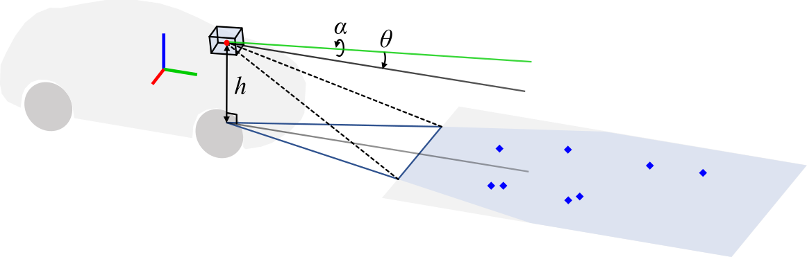
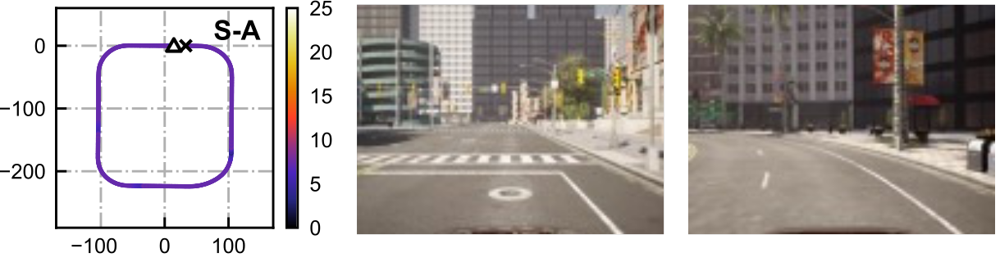
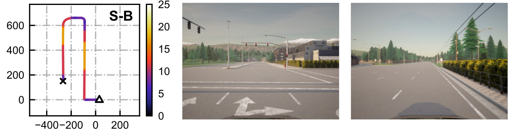
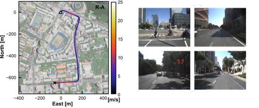
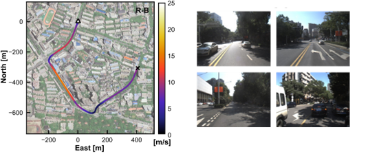
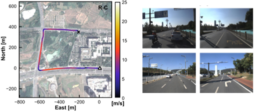
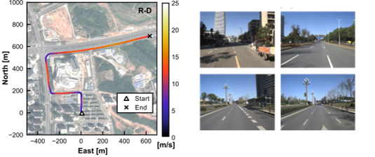
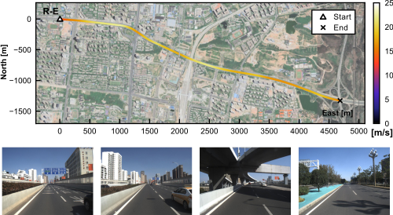
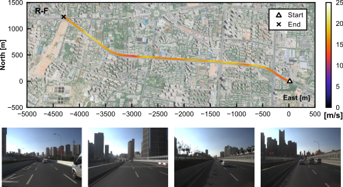

# Ground-vision toolkit
A toolkit for ground feature processing, inverse perspective mapping (IPM) and so on, which is applied in our preprint [Ground-VIO](https://arxiv.org/abs/2306.08341).
<br/><br/>

<div align=center>

</div>

## News
- [2023/07/11] - Initial release of code and dataset.

## Introduction
This toolkit fully utilizes the **camera-ground geometry** for accurate ground feature tracking. In the preprint, we verify that the estimation of vehicle states, the calibration of camera-ground geometry and stable feature tracking could be leveraged in a monocular visual-inertial estimator.

<div align=center>

</div>
<div align=center>

</div>


## Dataset
This repo also provides the urban road visual-inertial dataset used in [Ground-VIO](https://arxiv.org/abs/2306.08341).

The dataset contains both [Carla](https://github.com/carla-simulator/carla) simulated data sequences (S-A, S-B) and real-world data squences (R-A, R-B, R-C, R-D, R-E and R-F). The detail information is listed below. For real-world data sequences, the GT poses are obtained from the forward-and-backward smoothed solution of PPK/tactical-grade IMU integration

### Simulation Data (Carla)
  | Sequence | Date | Length |Sensors |Features |Image |
  | :---:  | :---:  | :---:  |:---:  |:---:  |:---:  |  
  | S-A |-| 110 s| IMU/Camera/Semantic |Urban road||
  | S-B |-| 135 s| IMU/Camera/Semantic |Urban road||

### Real-World Data
  | Sequence | Date| Length |Sensors |Features |Image |
  | :---:  | :---:  | :---:  |:---:  |:---:  |:---:  |    
  | R-A |2022/10/12| 180 s|IMU/Camera |Urban road| |
  | R-B |2022/10/12| 180 s|IMU/Camera |Urban road| |
  | R-C |2022/10/12| 180 s|IMU/Camera |Urban road| |
  | R-D |2022/10/12| 180 s|IMU/Camera |Urban road| |
  | R-E |2022/10/12| 270 s|IMU/Camera |Highway   | |
  | R-F |2022/10/12| 270 s|IMU/Camera |Highway   | |

Dataset is available at [OneDrive](https://whueducn-my.sharepoint.com/:f:/g/personal/2015301610143_whu_edu_cn/Evbp_Tf3GGdHtjI890ZfuUsByA0VF6DuMAJS7bqsiOUz-g?e=r3NQI9).

## Dependencies
The dependencies include **Eigen** and **OpenCV**. We use the **[camodocal](https://github.com/hengli/camodocal)** project to handle camera models, while we modify it to a minimal version which doesn't need **Ceres**.

## Getting Started
The project could be built either **with** or **without ROS**.


### Building with ROS

Follow the steps to build the project in a ROS workspace
```Bash
mkdir catkin_ws
mkdir catkin_ws/src
cd catkin_ws/src
git clone https://github.com/GREAT-WHU/gv_tools
cd ..
catkin_make
```

To run the ground tracker node, following
```Bash
source devel/setup.bash
roslaunch gv_tools track_carla_example.launch
```
and a rviz viewer would be simultaneously launched.

Then play the data bag in another terminal
```Bash
rosbag play s_a.bag
```

### Building without ROS
To build the project just as a plain CMake project
```Bash
git clone https://github.com/GREAT-WHU/gv_tools
cd gv_tools
mkdir build && cd build
cmake ..
make -j8
```
Run the example *track_dataset* following
```Bash
./build/track_dataset ./config/realworld/tracker.yaml DATASET_DIR/data_r_a/cam0/ DATASET_DIR/data_r_a/stamp.txt DATASET_DIR/data_r_a/gt_pose.txt 
```

## Acknowledgements
The toolkit is developed by GREAT (GNSS+ REsearch, Application and Teaching) Group, School of Geodesy and Geomatics, Wuhan University. 


Thanks to [VINS-Fusion](https://github.com/HKUST-Aerial-Robotics/VINS-Fusion) for excellent open-source codes. Thanks to [msckf-vio](https://github.com/KumarRobotics/msckf_vio) for inspring grid-based feature extraction method.

## Credit / Licensing

```txt
@article{zhou2023groundvio,
  title={Ground-VIO: Monocular Visual-Inertial Odometry with Online Calibration of Camera-Ground Geometric Parameters},
  author={Yuxuan Zhou, Xingxing Li, Shengyu Li, Xuanbin Wang, Zhiheng Shen},
  journal={arXiv preprint arXiv:arXiv:2306.08341},
  year={2023}
}
```

The codebase and documentation is licensed under the [GNU General Public License v3 (GPL-3)](https://www.gnu.org/licenses/gpl-3.0.txt).